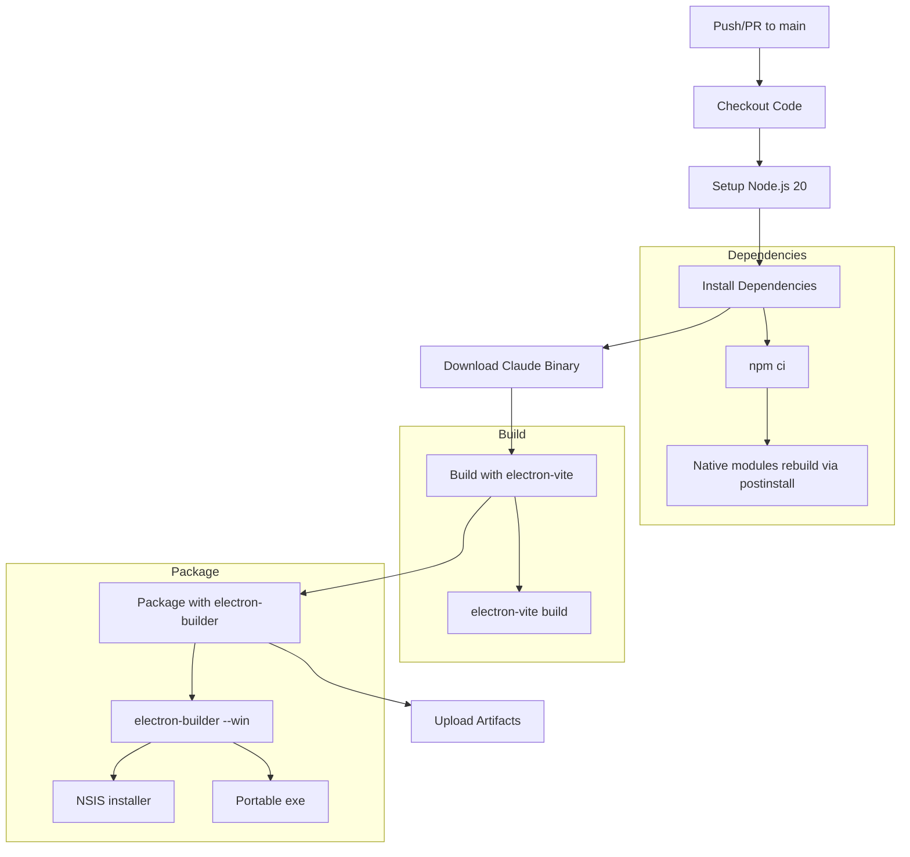

# GitHub Actions Windows Build Plan for 1Code Electron App

## Overview

This plan outlines the GitHub Actions workflow setup for building the 1Code Electron app for Windows. The workflow will build the app without code signing since no trusted certificate is available.

## Project Analysis

### Key Configuration Files

1. **[`package.json`](../package.json)** - Contains:
   - `electron-builder` v25.1.8
   - `electron-vite` v3.0.0
   - `electron` v33.4.5
   - Native modules: `better-sqlite3`, `node-pty`
   - Build scripts: `build`, `package:win`
   - `postinstall` script runs `electron-rebuild` for native modules

2. **[`electron-builder.yml`](../electron-builder.yml)** - Contains:
   - Mac-specific code signing configuration (not needed for Windows without signing)

3. **Build Configuration in package.json**:
   - Windows targets: `nsis` and `portable`
   - Icon: `build/icon.ico`
   - Output directory: `release`
   - Native modules to unpack from ASAR: `better-sqlite3`, `node-pty`, `@anthropic-ai/claude-agent-sdk`

### Critical Dependencies

1. **Claude Binary Download** - The app requires downloading Claude Code binaries via [`scripts/download-claude-binary.mjs`](../scripts/download-claude-binary.mjs:1)
   - Downloads to `resources/bin/win32-x64/claude.exe`
   - Required before packaging

2. **Native Modules**:
   - `better-sqlite3` - SQLite database
   - `node-pty` - Terminal emulation
   - Both require compilation with Visual Studio Build Tools

## Workflow Architecture



## Workflow File Structure

### File Location
`.github/workflows/build-windows.yml`

### Trigger Strategy
- **Push to main branch**: Build and create artifacts
- **Pull requests**: Build only for validation
- **Manual dispatch**: Allow manual builds with optional version tag

### Runner Environment
- `windows-latest` (Windows Server 2022)
- Pre-installed: Visual Studio Build Tools, Python, Node.js

### Key Steps

1. **Checkout** - `actions/checkout@v4`
2. **Setup Node.js** - `actions/setup-node@v4` with Node 20.x and npm cache
3. **Install dependencies** - `npm ci` (triggers postinstall which runs electron-rebuild)
4. **Download Claude binary** - `npm run claude:download` (for win32-x64)
5. **Build app** - `npm run build` (electron-vite build)
6. **Package** - `npx electron-builder --win --publish never`
7. **Upload artifacts** - `actions/upload-artifact@v4`

## Configuration Requirements

### Disable Code Signing

Since no certificate is available, we need to configure electron-builder to skip signing:
- Set environment variable: `CSC_IDENTITY_AUTO_DISCOVERY=false`
- Or use `win.signAndEditExecutable: false` in config

### Build Icon

The [`package.json`](../package.json:217) references `build/icon.ico` but the file does not exist in the repository. Options:
1. **Generate icon**: Use the [`scripts/generate-icon.mjs`](../scripts/generate-icon.mjs:1) script (requires source icon.png)
2. **Add icon file**: Commit a build/icon.ico file to the repository
3. **Remove icon requirement**: Let electron-builder use default icon

**Recommendation**: Add a `build/icon.ico` file to the repository or update electron-builder config to not require it.

## Proposed Workflow

```yaml
name: Build Windows

on:
  push:
    branches: [main]
  pull_request:
    branches: [main]
  workflow_dispatch:
    inputs:
      create_release:
        description: Create GitHub Release
        type: boolean
        default: false

jobs:
  build-windows:
    runs-on: windows-latest
    
    steps:
      - name: Checkout code
        uses: actions/checkout@v4

      - name: Setup Node.js
        uses: actions/setup-node@v4
        with:
          node-version: 20
          cache: npm

      - name: Install dependencies
        run: npm ci
        env:
          npm_config_python: python

      - name: Download Claude binary
        run: npm run claude:download

      - name: Build application
        run: npm run build

      - name: Package for Windows
        run: npx electron-builder --win --publish never
        env:
          CSC_IDENTITY_AUTO_DISCOVERY: false

      - name: Upload NSIS installer
        uses: actions/upload-artifact@v4
        with:
          name: windows-installer
          path: release/*.exe
          if-no-files-found: error

      - name: Upload portable
        uses: actions/upload-artifact@v4
        with:
          name: windows-portable
          path: release/*-portable.exe
          if-no-files-found: warn
```

## Prerequisites Checklist

Before the workflow can run successfully:

- [ ] **Icon file**: Ensure `build/icon.ico` exists in the repository
- [ ] **.github/workflows directory**: Create the directory structure
- [ ] **Repository secrets**: None required for unsigned builds
- [ ] **Claude binary access**: Verify the Google Cloud Storage URL is accessible from GitHub Actions

## Potential Issues and Mitigations

### 1. Native Module Compilation
**Issue**: `better-sqlite3` and `node-pty` require native compilation
**Mitigation**: Windows runners have Visual Studio Build Tools pre-installed. The `postinstall` script runs `electron-rebuild` automatically.

### 2. Missing Icon File
**Issue**: `build/icon.ico` is referenced but may not exist
**Mitigation**: Either add the icon file or modify electron-builder config

### 3. Claude Binary Download
**Issue**: Network issues downloading from Google Cloud Storage
**Mitigation**: Add retry logic or cache the binary

### 4. Unsigned Executable Warning
**Issue**: Windows SmartScreen will warn users about unsigned executables
**Mitigation**: This is expected behavior without code signing. Document in release notes.

## Alternative Approaches

### Option A: Use electron-builder-action (Marketplace)
```yaml
- name: Build/release Electron app
  uses: samuelmeuli/action-electron-builder@v1
  with:
    github_token: ${{ secrets.GITHUB_TOKEN }}
    release: false
```
**Pros**: Simplified setup, handles caching
**Cons**: Less control, may not handle custom download script

### Option B: Custom workflow (Recommended)
As outlined above - full control over each step
**Pros**: Full control, can handle custom requirements like Claude binary download
**Cons**: More setup required

## Next Steps

1. Create `build/icon.ico` file (if not exists)
2. Create `.github/workflows/build-windows.yml`
3. Test the workflow with a push to main branch
4. Verify artifacts are uploaded correctly
5. Optionally add release creation for tagged commits

## Notes

- The workflow does not include macOS or Linux builds - this plan is Windows-specific as requested
- Code signing can be added later by setting up `WIN_CSC_LINK` and `WIN_CSC_KEY_PASSWORD` secrets
- Build time is expected to be 5-10 minutes depending on cache state
